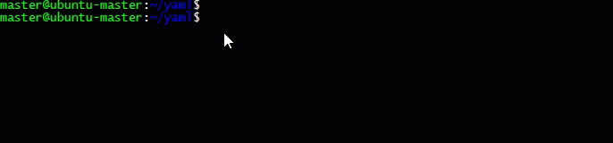

## Welcome to the Kubernetes cheat sheet for shorthand configurations


### create .vimrc file to set the VIM interpreter to best config

create a `.vimrc` file at the root location

`vim ~/.vimrc`

post this update it with following commands

```
set number
set smarttab
set autoindent
set shiftwidth=2
set expandtab
```
Set the alias for the `kubectl`

`alias k=kubectl`

#### Auto-Complete in linux 
```
source <(kubectl completion bash)
echo "source <(kubectl completion bash)" >> ~/.bashrc
alias k=kubectl
complete -F __start_kubectl k
```

## Linux Commands Cheatsheets

### Reverse Search

Press `ctrl+r` type the `Keyword` in the command history


### grep

Use the `grep` command after the _`pipe`_ command with below useful switch

`-i`, `--ignore-case` --> ignore case distinctions in patterns and data

`--no-ignore-case`      do not ignore case distinctions (default)


#### Context control:

  `-B`, `--before-context=NUM`  print NUM lines of leading context

  `-A`, `--after-context=NUM`   print NUM lines of trailing context

  `-C`, `--context=NUM`         print NUM lines of output context


## Kubernetes Cheatsheet

### K8s Useful switch(s)
To get all pods in all Namespaces

`k get all -A`


|shorthand | description |
| -------- | ----------- | 
|`-A` | used for shorthand for `--all-namespaces` |
|`-o wide`| display the complete details if the command e.g. labels etc|
|`sudo swapoff -a`| if the error occurs "The connection to the server <_master node>:6443_ was refused - did you specify the right host or port?"|
| `less /var/log/syslog` | running logs of the server |
|`: ` + _shift +end_ | makes the realtime log stream in the syslog|
|`du -h /opt/` | gives the file size of the path provided |
| `wc -l` | gives you the word count length |
| `sed 's/unix/linux/2'` | sed command is Stream Editor where `'s'` == substitute/'_what_'/'_with what_'/`'2'` (replace second occurance)in the line|


### Pods

`k run pod --image=nginx --dry-run=client -oyaml >pod.yaml`
#### remote into Pod
below command remote into the POD and keep the session alive

`k exec --stdin --tty ds-one-kjds -- /bin/bash`

below command remote into the POD and get the output by closing the session

`k exec pod-name --ti -- /bin/bash -c 'ls -l'`

#### List Pods
....

| Command  | description |
| --------- | ------------- |
| `kubectl get pods` | list the pod within default namespace |
| `kubectl get pods -o wide` | list all the pod with detailed view |
| `kubectl get pods -n kube-system` | List the pods within given Namespace |
| `kubectl get pods --selector app=test` | list all the pods which have given selector |
| `kubectl get pods --selector app=test, application=testing` | filter and list all the pods with combination of selector criteria |
| `kubectl get pods -A` _or_ `kubectl get pods --all-namespaces` | list all the pods for all namespaces within the cluster |
| `kubectl get pods --show-labels` | list all pods with list of labels |
| `kubectl describe pod xyz` | get the status of the pods |


### ReplicaSets

### Services

```
kubectl expose deployment nginx --port=80 --type=NodePort
```
```
Kubectl get svc
kubectl get ep
```
-- A particular _port_ and  _targetPort_ can also be specified during object creation to avoid random values to ports.

-- The range of cluster IPs and the range of ports used for the random NodePort are configurable in the API server startup options.

-- Services can also be used to point to a service in a different namespace, or even a resource outside the cluster, such as a legacy application not yet in Kubernetes

|Service Type| Description |
|---------|---------- |
|_ClusterIP_ | It is default Service Type and provide access internally. Range Defined within API server Startup option |
|_NodePort_ | It is required for the debugging or when a static IP is required to open through Firewall. range is defined in Cluster Configuration |
|_LoadBalancer_ | it works well with the Cloud Porider (GKE/AWS) or thier plugin in Private Cloud. the address is made available to public traffic, and packets are spread among the Pods in the deployment automatically |
|_ExternalName_ | _This is new service_ which allows the return of alias to the external Service. It happens at the DNS level. |

##### coredns

`dig 10.96.0.10 -x 10.96.0.10`

_**-x**_ agrument returns the FQDN of the IP we know.

_Edit_ configMap for the CodeDNS Pod will adjust the FQDN domain resolution


```
apiVersion: v1
data:
  Corefile: |
    .:53 {
        rewrite stop {
        name regex (.*)\.test\.io {1}.default.svc.cluster.local
        answer name (.*)\.default\.svc\.cluster\.local {1}.test.io
          }
        errors
        health {
           lameduck 5s
        }
        ready
        kubernetes cluster.local in-addr.arpa ip6.arpa {
           pods insecure
           fallthrough in-addr.arpa ip6.arpa
           ttl 30
        }
        prometheus :9153
        forward . /etc/resolv.conf {
           max_concurrent 1000
        }
        cache 30
        loop
        reload
        loadbalance
    }
kind: ConfigMap
......
```
### Ingress

Ingress controller is more efficient over the use of Services to expose containerized application to the outside world.
Instead of using lots of services, such as _LoadBalancer_, you can route traffic based on the request host or path. This allows for centralization of many services to a single point.

Multiple Ingress Controllers can be deployed. Traffic should use _annotations_ to select the proper controller. The lack of a matching annotation will cause every controller to attempt to satisfy the ingress traffic.

```
k get ingress
k delete ingress <name of the ingress>
k edit ingress <name of the ingress>
```
#### Service Mesh

The _Service Mesh_ provide the complex connection/resources such as 
- Service Discovery
- Rate Limiting
- Traffic Management
- Advanced Metrics
### Labels

```
kubectl get nodes -l system=secondary

k get po -n testing --show-labels

k delete pods -n testing -l system=secondary

k get all -A -o wide --show-labels
```

Label Node:

`k label node ubuntu-worker system=secondary`

remove label from Node:

`k label node ubuntu-worker system-`

### Job & CronJobs

### annotations

### Deployments

### DaemonSets


Example Yaml
```
apiVersion: apps/v1
kind: DaemonSet
metadata:
  name: ds-one
spec:
  selector:
    matchLabels:
      system: DaemonSetOne
  template:
    metadata:
      labels:
        system: DaemonSetOne
    spec:
      containers:
      - name: nginx
        image: nginx:1.15.1
        ports:
        - containerPort: 80
```
### Rolling Updates and Rollbacks

flag _`OnDelete`_ upgrades the container when the predecessor is deleted.

Flag _`RollingUpdate`_ begins the update immediately.


### Volume and Data

- Encoded data can be passed using a Secret and non-encoded data can be passed with a _ConfigMap_. These can be used to pass important data like _SSH keys_, _passwords_, or even a configuration file like `/etc/hosts`.
The cluster groups volumes with the same mode together, then sorts volumes by size, from smallest to largest. The claim is checked against each in that access mode group, until a volume of sufficient size matches.The three access modes are:

    - ReadWriteOnce, which allows read-write by a single node.
    - ReadOnlyMany, which allows read-only by multiple nodes.
    - ReadWriteMany, which allows read-write by many nodes. 

**_Note:_** Within any given POD yaml defination, _VolumeMounts_ section gets added under _containers_ and _volumes_ section to General _spec_.

Sample Yaml

```
apiVersion: v1
kind: Pod
metadata:
  labels:
    run: volumetest
  name: volumetest
spec:
  containers:
  - image: nginx
    name: volumetest
    command:
      - sleep
      - "3600"
    volumeMounts:
      - mountPath: /scratch
        name: scratch-volume
  volumes:
  - name: scratch-volume
    emptyDir: {}
  dnsPolicy: ClusterFirst
  restartPolicy: Always
```
  
#### Volume Types

|Cloud |  Volume Type |
|------|-------|
|GCE  |  GCEpersistentDisk |
|AWS  |  awsElasticBlockStore |

#### Persistent Volumes and Claims

Persistent storage phases

_**Provision** `==>` **Bind** `==>` **Use** `==>` **Release** `==>` **Reclaim**_

Commands:

`Kubectl get pv` 

`Kubectl get pvc`

#### Persistent Volume
Create a persistent Volume using below yaml
```
apiVersion: v1
kind: PersistentVolume
metadata:
  name: 10gpv01
  labels:
    type: local
spec:
  capacity:
    storage: 10Gi
  accessModes:
    - ReadWriteOnce
  hostPath:
    path: "/somepath/data01"
```
Sample Yaml of POD with nfs mount, before creating this deployment, i have defined PV and PVC using nfs volume

```
apiVersion: apps/v1
kind: Deployment
metadata:
  labels:
    app: nginx-pvc
  name: nginx-pvc
spec:
  replicas: 2
  selector:
    matchLabels:
      app: nginx-pvc
  template:
    metadata:
      labels:
        app: nginx-pvc
    spec:
      containers:
      - image: nginx
        name: nginx-pvc
        ports:
        - containerPort: 80
        volumeMounts:
        - name: nfs-vol
          mountPath: /opt
      volumes:
      - name: nfs-vol
        persistentVolumeClaim:
          claimName: pvc-one
```
#### Secrets

`kubectl get secrets`

_Syntax of creating the Secret_

```
kubectl create secret generic NAME [--type=string] [--from-file=[key=]source] [--from-literal=key1=value1]
```

Manually Encoding the a string with base64-encoding

`echo ThiSisTri@lP@$$word | base64`

**output** `==>` _VGhpU2lzVHJpQGxQQDIwMTh3b3JkCg==_

Example of using Secrets as the **_Environment Variable_**

```
spec:
  containers:
    - image: mysql:5.5
      env:
      - name: <MYSQL_ROOT_PASSWORD>
      valueFrom:
        secretKeyRef:
          name: mysql
          key: password
      name: mysql
```
Example

Create a Secret 

```
kubectl create secret generic mysql --from-literal=password=root
```
Create a Pod using the above created secret within the POD yaml 
```
apiVersion: v1
kind: Pod
metadata:
  name: secret-pod
  labels:
    type: secret
spec:
  containers:
  - name: busy
    image: busybox
    command:
      - sleep
      - "3600"
    volumeMounts:
    - mountPath: /mysqlpassword
      name: mysql
  volumes:
    - name: mysql
      secret:
        secretName: mysql
```
Dycrypt the secret stored withing the POD created above

```
kubecl exec -ti secret-pod --cat /mysqlpassword/password
```
#### ConfigMaps

 A ConfigMap is similar to a Secret which are basically Key-Value pairs, except they are not base64 byte encoded arrays. They are stored as strings and can be read in serialized form.
 
 There are 3 different ways, a configMap can ingest the data
 
 - From a Literal Value
 - From a file
 - From a directory of files

Example Pod creation with _ValueFrom_ ConfigMap
```
apiVersion: v1
kind: Pod
metadata:
  name: shell-demo
spec:
  containers:
    - name: nginx
      image: nginx
      env:
      - name: ilike
        valueFrom:
          configMapKeyRef:
            name: color
            key: favorite
```
ConfigMap values can be stored as the _enviroment Variables_ with in the POD

```
apiVersion: v1
kind: Pod
metadata:
  name: shell-demo
spec:
  containers:
    - name: nginx
      image: nginx
      envFrom:
      - configMapRef:
          name: colors
```
ConfigMap can also be mapped as the _Volume_ to the POD

```
apiVersion: v1
kind: ConfigMap
metadata:
  name: tomoto
  namespace: default
data:
  food.color: red
  food.shape: round
  food.type: vegetable
```
Create POD using the above configMap
```
apiVersion: v1
kind: Pod
metadata:
  name: shell-demo
spec:
  containers:
  - name: nginx
    image: nginx
    volumeMounts:
    - name: car-vol
      mountPath: /etc/cars
  volumes:
  - name: car-vol
    configMap:
      name: fast-car
```
#### Resource Quota
use the _ResourceQuota_ object to both limit the total consumption as well as the number of persistent volume claims (PVC)

```
apiVersion: v1
kind: ResourceQuota
metadata:
  name: storagequota
spec:
  hard:
    persistentvolumeclaims: "10"
    requests.storage: "500Mi"
```
Update the _Retention Policy_ to either _Delete_ , _Retain_ or _Recycle_

```
kubectl patch pv pvvol-1 -p \
'{"spec":{"persistentVolumeReclaimPolicy":"Delete"}}'
```
### Scheduling
#### Kube-Scheduler
  The Kube-scheduler determines the nodes for the POD placement using _Topology-aware_ Algorithm.
  
  The Scheduler goes through a set of _filters_ or _Predicates_ to find available nodes and then rank each node using priority functions.

  #### Taints

  A node with a particular taint will repel Pods without tolerations for that taint. A taint is expressed as key=value:effect. The key and the value are created by the administrator.

  - NoScheduling
  - PreferNoScheduling
  - NoExecute

  #### Tolerations

  Setting tolerations on a node are used to schedule Pods on tainted nodes. This provides an easy way to avoid Pods using the node. Only those with a particular toleration would be scheduled.
